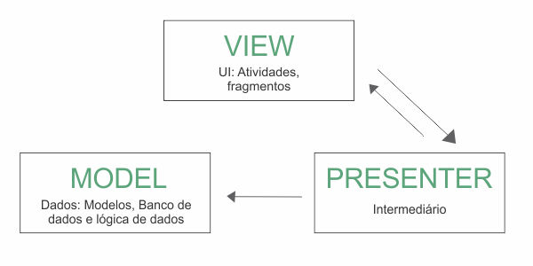

# My Pokemon App

### Libraries
- Retrofit (serve para fazer chamadas em API)
- Coroutine (Serve para trabalhar com processamento "paralelo")
- Gson (serve para converter json em classe)
- Koin (serve para fazer injeção de dependência)
- Glide (servce para fazer download de imagem)

### Arquitetura MVP(Model View Presenter)
Recomendada para se trabalhar com xml no Android Studio e faz uma boa separação 
de regra de negócio e view.

- Model (Camada responsável pela regra de negócio e infra-estrutura)
- View (Camada responsável pela exibição de UI)
- Presenter (Camada responsável pela lógica e estado de UI)